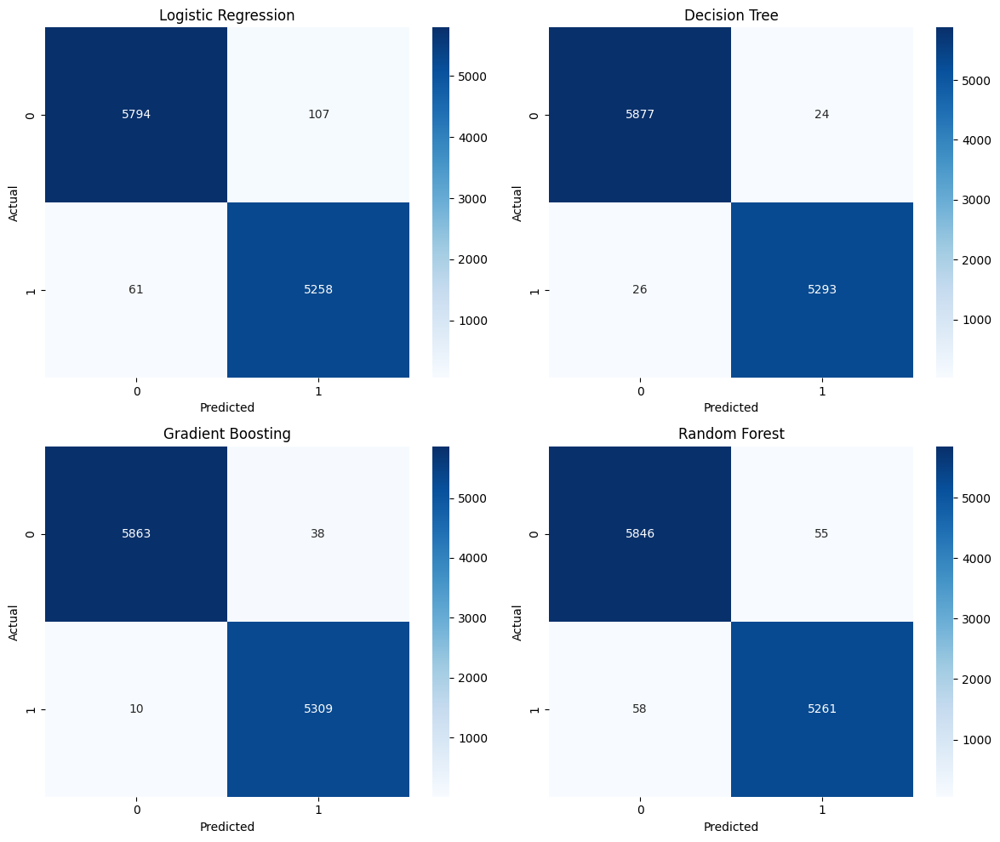
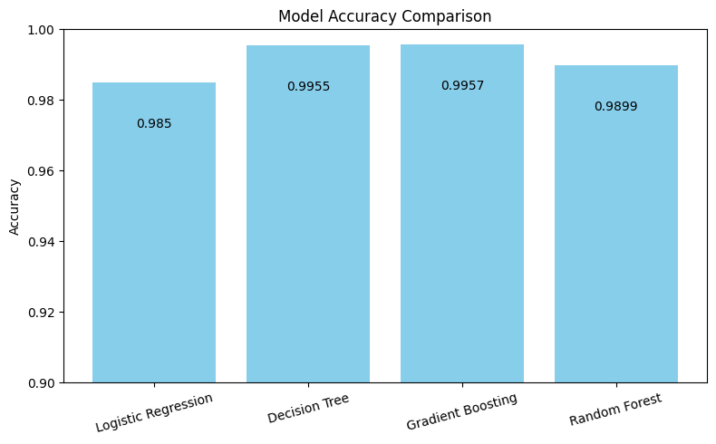

# Fake-News-Detection-using-Machine-Learning
A machine learning project that detects fake news articles using Natural Language Processing (NLP) and classifiers like Logistic Regression, Random Forest, and Gradient Boosting. Achieves over 99% accuracy with TF-IDF features and real-world news data.

---

## 🔍 Features

- Clean and preprocess news article text
- Feature extraction using TF-IDF
- Trained multiple models:
  - Logistic Regression
  - Decision Tree
  - Gradient Boosting
  - Random Forest
- Evaluation using Accuracy, Precision, Recall, F1-score
- Confusion Matrix heatmaps and accuracy plots
- Manual testing option for custom news input

---

## 🧪 Model Performance

| Model                    | Accuracy | Precision | Recall | F1-Score |
|--------------------------|----------|-----------|--------|----------|
| Logistic Regression      | 0.985    | 0.98      | 0.99   | 0.98     |
| Decision Tree            | 0.9955   | 1.00      | 0.995  | 0.997    |
| Gradient Boosting        | 0.9957   | 0.99      | 1.00   | 0.995    |
| Random Forest            | 0.9899   | 0.99      | 0.99   | 0.99     |

---

## 📊 Visualizations

### 🔥 Confusion Matrices


### 📈 Accuracy Comparison


---

## 🗃️ Dataset

> **Fake and Real News Dataset**  
Source: [Kaggle](https://www.kaggle.com/clmentbisaillon/fake-and-real-news-dataset)  
Includes both real and fake news labeled with classes.

---

## 🧠 Try Manual Testing

```python
manual_testing("Aliens Sign Peace Treaty With Earth’s Leaders in Secret Antarctica Summit...")
